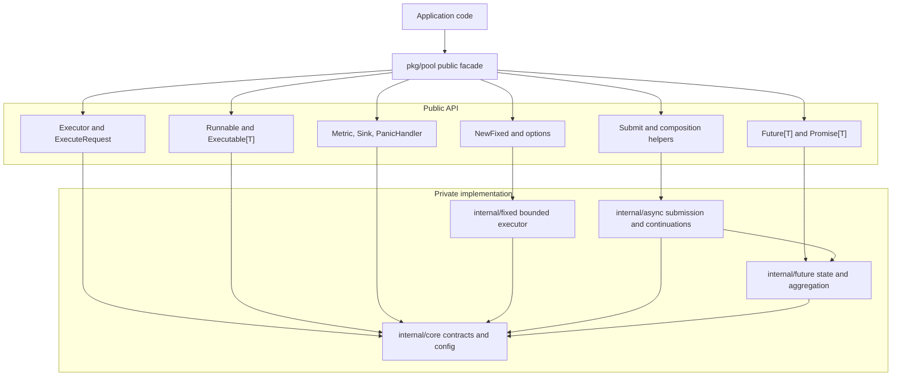
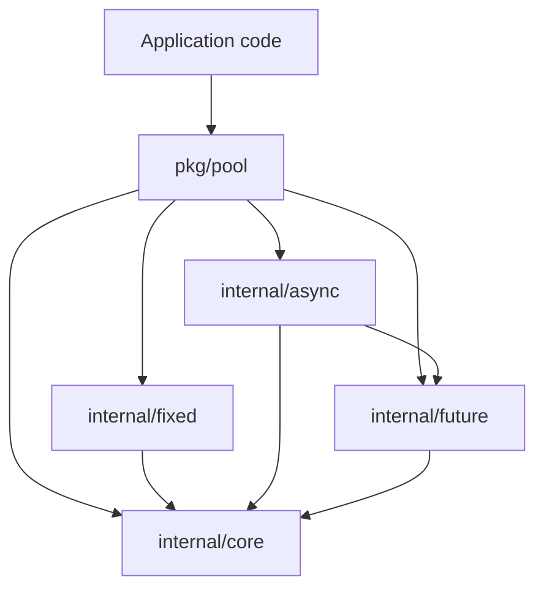
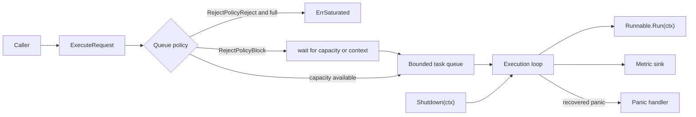
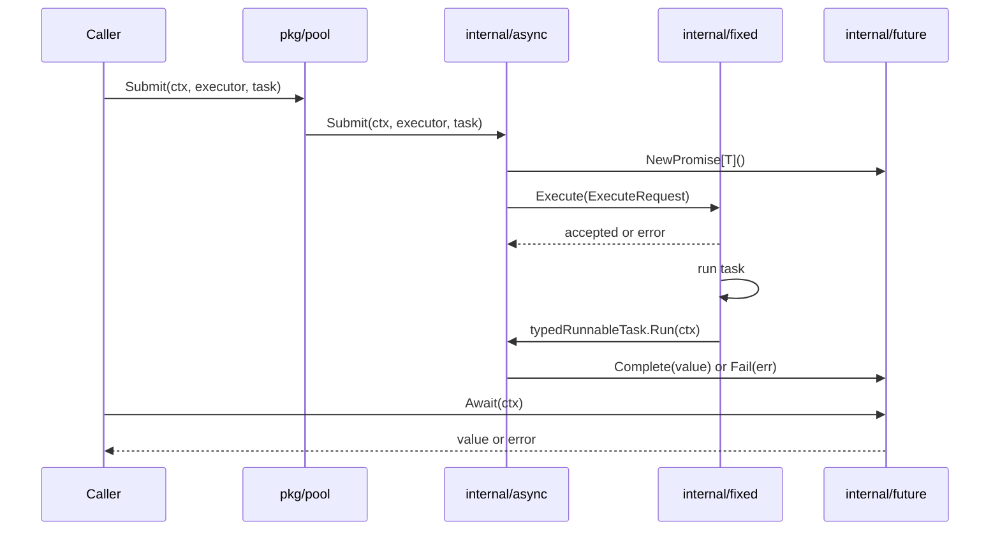
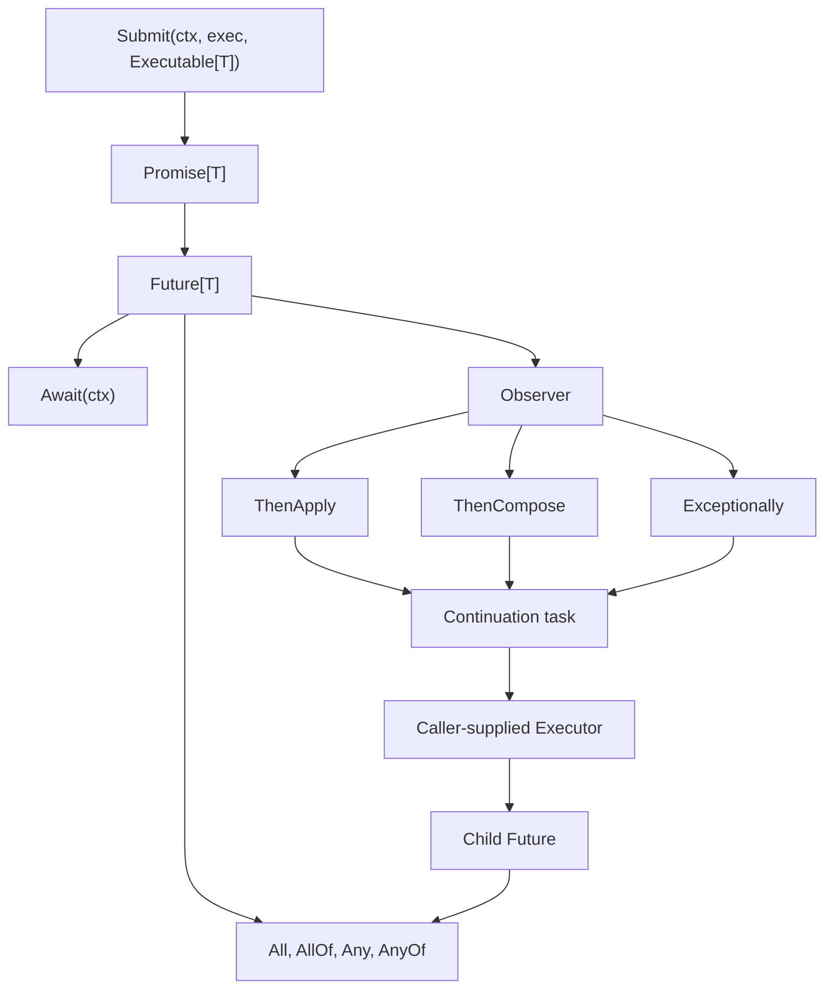
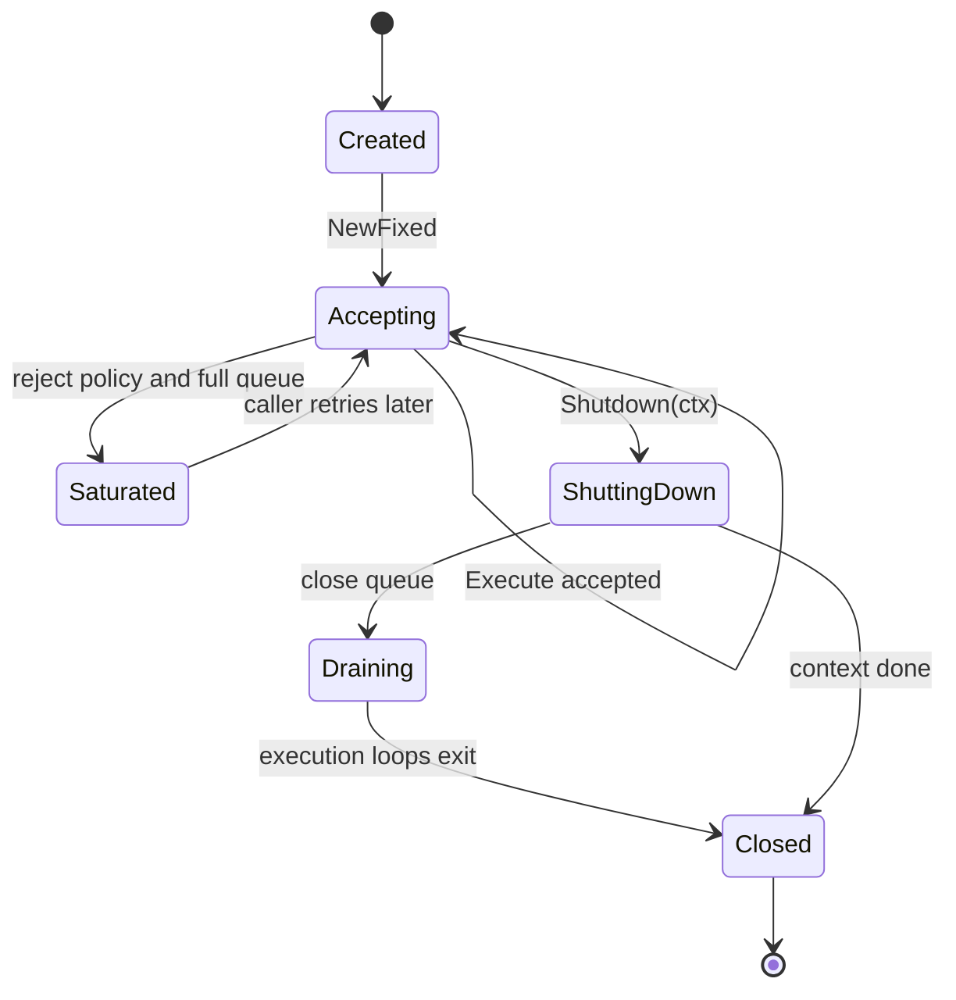
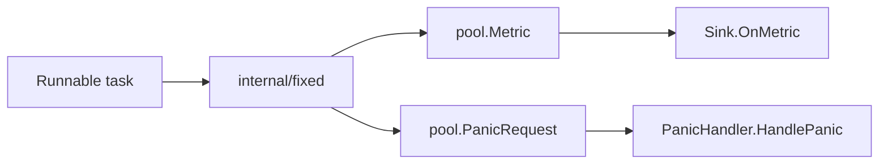

# Architecture

`pool.go` is organized as a public facade package backed by private
implementation packages.

## System Architecture



Applications import only `pkg/pool`. The facade exposes stable contracts and
constructors. Implementation packages stay behind the root `internal/`
boundary and are organized by responsibility: shared contracts, fixed
execution, future state, and asynchronous composition.

## Package Structure

```text
pkg/pool/
  aggregation.go
  async.go
  composition_task.go
  doc.go
  errors.go
  executor.go
  fixed.go
  future.go
  metrics.go
  option.go
  promise.go
  runnable.go
  submit_option.go
  task.go

internal/core/
  errors.go
  executor.go
  metrics.go
  option.go
  runnable.go
  task.go

internal/fixed/
  executor.go
  runner.go

internal/future/
  aggregation.go
  aggregation_observer.go
  future.go
  observer.go
  promise.go
  result.go
  subscription.go

internal/async/
  composition_task.go
  continuation.go
  continuation_observer.go
  submit.go
  submit_option.go
```

`pkg/pool` is the only public import path. It re-exports contracts and
constructors from private packages so external callers do not depend on
implementation package names.

## Dependency Direction



Private packages do not import `pkg/pool`. This keeps dependency direction
acyclic and prevents facade types from leaking into implementation packages.

## Request Flow



`Execute` validates the request, applies the selected queue policy, and hands
accepted work to the bounded queue. Execution loops run tasks, emit metrics,
recover panics, and exit during shutdown.

## Typed Submit Flow



`Submit` converts typed work into a runnable task. The fixed executor owns queue
admission and task execution. The promise owns completion. The caller observes
the result through the returned future.

## Future And Composition Flow



`Promise[T]` is the producer-owned completion handle. `Future[T]` is the
read-only view consumed by callers, observers, aggregators, and continuation
helpers. Composition helpers register observers and submit continuation work
back to the executor supplied by the caller.

## Lifecycle Flow



The executor starts in accepting state after successful construction. Shutdown
stops new submissions, closes the queue after admission is excluded, and waits
for execution loops until completion or shutdown context cancellation.

## Fixed Executor

`internal/fixed.Fixed` owns:

- immutable validated configuration,
- bounded task queue,
- execution context and cancel function,
- wait group for execution loops,
- closed state,
- synchronization around queue closure.

Admission rules:

- closed executor returns `ErrClosed`;
- nil runnable returns `ErrInvalid`;
- canceled request context returns the context error;
- reject policy returns `ErrSaturated` when configured and full;
- block policy waits for queue capacity, request cancellation, or shutdown.

Shutdown rules:

- shutdown is idempotent;
- new submissions stop after closed state is set;
- the queue is closed after submissions are excluded;
- shutdown waits for execution loops or returns the shutdown context error.

## Future And Promise

`internal/future` keeps completion state in `futureState[T]`:

- mutex-protected completion flag,
- result value,
- closed done channel,
- observer registry.

The promise completes the state once and releases observers after unlocking.
This avoids holding the state mutex while user observer code runs.

Aggregation helpers are implemented with observers and small synchronization
objects. `All` stores results in input order. `Any` and `AnyOf` complete on the
first successful result and only fail when all active futures fail or cancel.

## Async Composition

`internal/async` contains:

- task adapters for `Executable[T]`,
- continuation task interfaces,
- future observers for `ThenApply`, `ThenCompose`, and `Exceptionally`,
- submit options.

Continuations are not run inline inside future completion. They are submitted to
the caller-provided executor, so queueing, rejection, panic recovery, metrics,
and shutdown behavior stay consistent with normal task execution.

## Observability Flow



Metrics are emitted for task admission, start, completion, rejection, failure,
panic, and executor shutdown. Panic handling is optional. Recovered panics are
also represented as task panic metrics.

## Tests And CI

The public contract is tested through `pkg/pool` black-box tests and examples.
`pkg/pool/goleak_test.go` enables goroutine leak detection. CI runs:

- module tidy check,
- formatting check,
- shuffled tests with coverage,
- race tests,
- `go vet`,
- `golangci-lint`,
- benchmark smoke tests.

Benchmarks live under `benchmarks/` and measure core future and executor paths.
